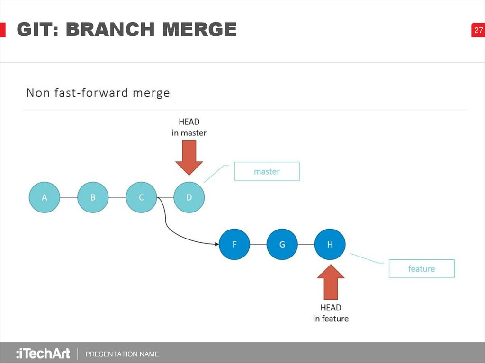

# Краткая справка по git у 

## Что такое ***git*** и зачем он нужен?

> **Git** - это специальная консольная утилита, для отслеживания и ведения истории файлов, проекта. Чаще всего используется для кода, но можно использовать и в других сферах.

С помощью гита можно откатить свой проект до более старой версии, а так же сравнить и проанализировать их различия. И загружать изменения в репозаторий.

>**Репозаторий** - хранилище вашего кода и история его измений. git работает локально и все ваши репозатории хранятся на вашем жёстком диске.

Так же репозаторий может быть в интернете например 
* *github*
*  *gitlab*
* *Bitbucket*
* *и другие сервисы...*

## **Как работает Git?** 

Что бы понять принцип работы Гита посмотрим накартинку: 
Каждый кружок на ней это различные версии файла(commit) начиная от самой первой A заканчивая текущей D Ветки master, Про ветку feature запишу после прокождения ветвления.
> В любой момент мы можем вернуться к той или иной версии файла.

## Установка git на ПК

для различных оперционных систем установка различается поэтому распишем для них подробнее

 ###  **Для** ***Windows***
 ##### *Вариант 1*
* Перейти на сайт [git-scm.com](https://git-scm.com/download/win) выбрать нужную нам разрядность и загрузить на компьютер.
* запустить скачанный файл и установить следуя инструкции.
#### *Вариант 2 если установлен winget tool*
* В Powershell или командной страке вводим команду
> winget install --id Git.Git -e --source winget

### **Для** ***MacOS***
* Если установлен Homebrew
    >brew install git

* Если нет, то вводим эту команду:
    + > git --version
    + >После этого появится окно, где предложит установить Command Line Tools (CLT).
    + >Соглашаемся и ждем установки. Вместе с CLT установиться и git

### **Для** ***Linux***
* Debian или Ubuntu
     >sudo apt install git

* CentOS
    >sudo yum install git

## Настройка Гита

После установки гита в консоли
## Команды гита
* git --version - команда для проверки версий

* git int - создание репозатория

* git status - проверка статуса

* git add файл.расширение - добавление файла в гит 

* git add . - добавить версионность всем файлам в папке

* git commit -m "mesage" - команда для фиксации изменениий файлов

* git commit -am "message" -фиксация изменений без git add

* git diff -вывод изменений на текущий момент

* git log - вывод истории изменения файла

* git checkout хеш commita - переключение между версий файла

* git checkout master - возврат в ветку мастер к текущему состоянию