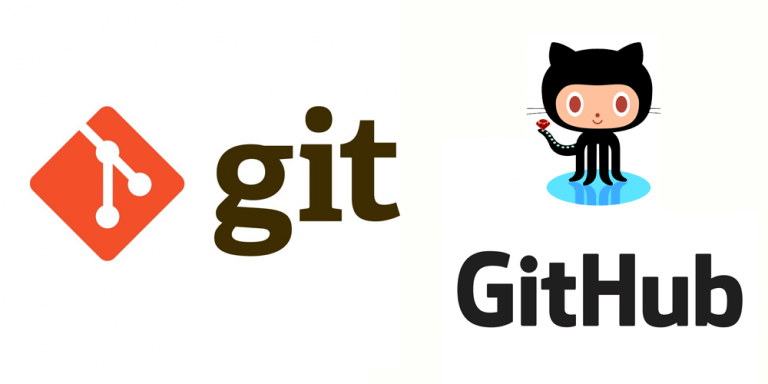
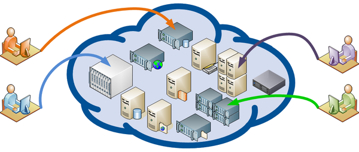

# Краткая справка по gitу 

## Что такое ***git*** и зачем он нужен?

> **Git** - это специальная консольная утилита, для отслеживания и ведения истории файлов, проекта. Чаще всего используется для кода, но можно использовать и в других сферах.

С помощью гита можно откатить свой проект до более старой версии, а так же сравнить и проанализировать их различия. И загружать изменения в репозаторий.

>**Репозаторий** - хранилище вашего кода и история его измений. git работает локально и все ваши репозатории хранятся на вашем жёстком диске.

Так же репозаторий может быть в интернете например 
* *github*
*  *gitlab*
* *Bitbucket*
* *и другие сервисы...*

## как работает Git? 

* git --version - команда для проверки версий

* git int - создание репозатория

* git status - проверка статуса

* git add файл.расширение - добавление файла в гит 

* git add . - добавить версионность всем файлам в папке

* git commit -m "mesage" - команда для фиксации изменениий файлов

* git commit -am "message" -фиксация изменений без git add

* git diff -вывод изменений на текущий момент

* git log - вывод истории изменения файла

* git checkout хеш commita - переключение между версий файла

* git checkout master - возврат в ветку мастер к текущему состоянию